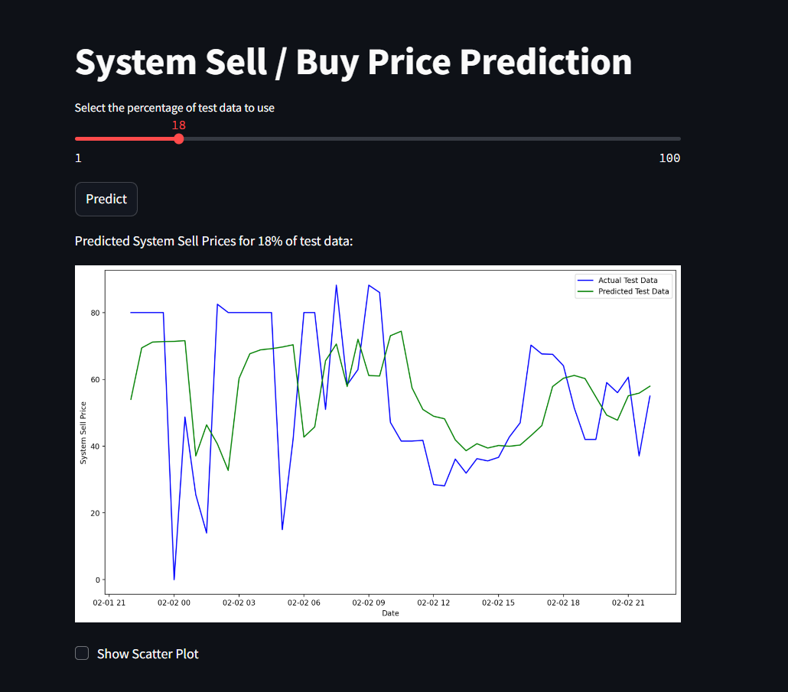

## Imbalance Pricing Forecasting Model<br><br>
[Model development](https://github.com/JeffM-Code/PortfolioWork/tree/main/ML/ImbalancePricing)<br><br>
[App](https://imbalancepricingforecastmodel.streamlit.app/)<br><br>

Toggle the predicted vs actual values of model to see how well the model predicts system buy / sell prices. The slider introduces a percentage of the data into the model and populates the values available for the model to forecast based on.<br><br>

### Example:<br><br>
<br><br>

<br><br> The original model is based on LSTM model forecasting, however there seem to be many issues with loading that model into streamlit, so for now I will have to use a model that accomplishes the same goal of forecasting. The point is to implement a forecasting model to inform trading strategies, so this effectively does the same thing, although i'll try to load the LSTM model so that the app and model development are $1:1$.<br><br>

For this random forest model:<br><br>

```
scaler = MinMaxScaler(feature_range=(0, 1))
scaled_data = scaler.fit_transform(combined_price_data)

```
<br>

The use of MinMaxScaler ensures that, the data is scaled between 0 and 1, which is essential for models sensitive to the scale of input data, however, the model's performance might vary if the data distribution changes significantly over time.<br><br>

```
time_step = 10

```
<br>

The model uses lagged values of the time series to make predictions, so the choice of the time_step (pertaining to number of previous time steps used) is crucial, as too small a time_step could miss essential trends, while an overly large one might add unnecessary complexity.<br><br>

```
model = RandomForestRegressor(n_estimators=100)

```
<br>


As for the n_estimators hyperparameter, more trees generally improve performance but increase computational cost.<br><br>


### Expected Model Performance:<br><br>

```
MSE: 3550.134288836358
RMSE: 59.58300335528881
MAE: 52.289436612899
R2 Score: -88070.73866494466

```