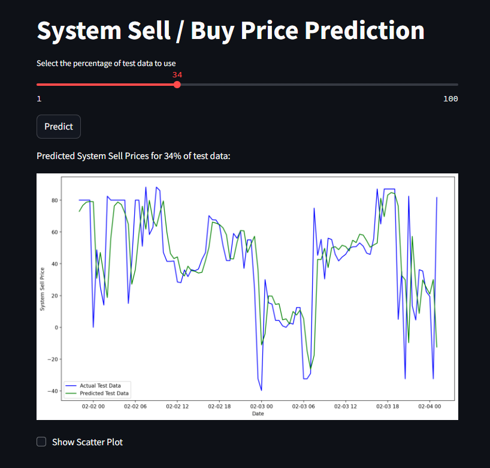

## Imbalance Pricing Forecasting Model<br><br>
[Model development](https://github.com/JeffM-Code/PortfolioWork/tree/main/ML/ImbalancePricing)<br><br>
[App](https://imbalancepricingforecastmodel.streamlit.app/)<br><br>

Toggle the predicted vs actual values of model to see how well the model predicts system buy / sell prices. The slider introduces a percentage of the data into the model and populates the values available for the model to forecast based on.<br><br>

#### Illustration:<br><br>
<br><br>

Generally, it should forecast better, the more data it has to work with, with a few key things to note:<br><br>

```
lstm_model = Sequential()
lstm_model.add(LSTM(units=100, return_sequences=True, input_shape=(time_step, 1)))
lstm_model.add(Dropout(0.2))
lstm_model.add(LSTM(units=100, return_sequences=True))
lstm_model.add(Dropout(0.2))
lstm_model.add(LSTM(units=100))
lstm_model.add(Dropout(0.2))
lstm_model.add(Dense(units=50))
lstm_model.add(Dense(units=1))


```
<br><br>

The number of LSTM units and layers affects the model's ability to learn complex patterns in the data, usually visible in the level of jaggedness or fluctuations in the curve.<br><br>


```
lstm_model.compile(optimizer='adam', loss='mean_squared_error')

```
<br><br>

The choice of optimizer and loss function is crucial for the model's learning process, as they generally reduce training losses, where different optimizers have different strategies for updating the weights and can have a significant impact on the model's convergence speed and final performance.<br><br>


```
lstm_model.fit(X, y, batch_size=32, epochs=50)

```
<br><br>

Bach size and epoch parameters control the number of samples processed before the model's parameters are updated, as well as how many times the learning algorithm will work through the entire training dataset respectively.<br><br>


### Expected Model Performance:<br><br>

```
MSE: 914.6547672440631
RMSE: 30.243259864704783
MAE: 22.775557182210395
R2 Score: 0.30823812286315355

```